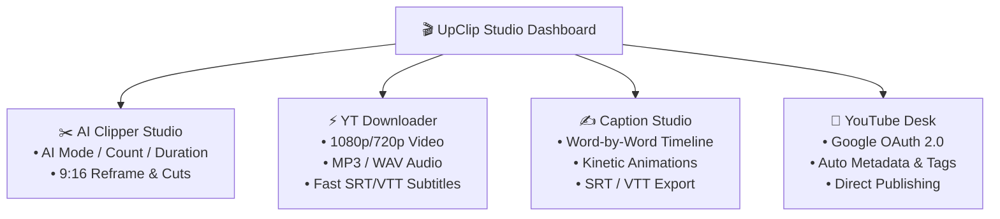

<div align="center">

# 🎬 UpClip Studio

**Next-Gen AI Shorts Studio, Intelligent Video Clipper & YouTube Automation Platform**

Turn any long-form video or YouTube link into viral short-form clips (9:16) automatically. Powered by content-aware scene detection, multi-modal AI ranking, OpenAI Whisper, kinetic animated subtitle rendering, and native YouTube publishing.

[](https://www.python.org/)
[](https://flask.palletsprojects.com/)
[](https://github.com/openai/whisper)
[](https://opencv.org/)
[](https://ffmpeg.org/)
[](LICENSE)

</div>

---

## 🌟 Key Highlights & Innovations

- **🛡️ 60s+ Floor & Sentence Boundary Snapping**: Strict minimum clip duration floor (60s–90s+) preventing premature cuts. Snaps clip start and end timestamps to natural sentence punctuation (`.`, `?`, `!`, `।`) and speech pauses (gap >= 0.35s) so spoken thoughts are never cut off mid-sentence.
- **📐 True Framing & Aspect Ratio Cropping (4:5 / 9:16 / 1:1)**: Full-frame landscape distortion eliminated. True center and face-aware cropping (`1080x1350` for 4:5 Instagram feed, `1080x1920` for 9:16 Shorts/Reels, `1080x1080` for 1:1 square).
- **🎞️ Non-Overlapping Kinetic Captions & 6 Trending Creator Presets**: 3–4 word bite-sized lines with strict sequential timing (Line 1 vanishes completely before Line 2 begins). Word-by-word karaoke highlight synchronized to speech. Includes 6 creator presets: **Hormozi Pop**, **MrBeast Glow**, **Red Punch**, **Clean Gold**, **Neon Cyber**, and **Karaoke Pill**.
- **🏷️ AI Content-Based Topic Naming**: Spoken transcript multi-word extraction replaces generic names with meaningful slugs (e.g. `Election_Commission_Controversy_01.mp4`).
- **📅 YouTube Smart Publishing Advisor & 1-Click Auto-Scheduler**: Algorithm-backed distribution across prime evening slots (6:30 PM–9:30 PM), automatic 4–6 hour inter-Shorts spacing, title character capping, and 1-click bulk scheduling.
- **⚡ Co-Located Subtitle Auto-Detection**: Instant loading of matching `.srt` in `input/` directory to skip redundant Whisper passes.
- **📱 Compact Review Grid & Adaptive Preview**: Dense, high-visibility 185px responsive grid cards and viewport-constrained aspect-adaptive preview player.

---

## 🧠 Comprehensive AI Engine Suite

UpClip Studio features a modular, enterprise-grade AI intelligence layer located in [`ai/`](ai/):

| Module | Class | Primary Functionality |
| :--- | :--- | :--- |
| [`ai/scene_detector.py`](ai/scene_detector.py) | `SceneDetector` | Detects visual camera cuts & natural pacing boundaries while enforcing a strict 15s–20s minimum duration floor. |
| [`ai/audio_energy.py`](ai/audio_energy.py) | `AudioEnergyDetector` | Computes RMS audio energy across time windows to detect volume peaks, audience applause, laughter, and punchlines. |
| [`ai/motion_detector.py`](ai/motion_detector.py) | `MotionDetector` | Frame-differencing computer vision engine measuring pixel velocity and visual activity (0–100 score). |
| [`ai/face_detector.py`](ai/face_detector.py) | `FaceDetector` | OpenCV Haar & DNN face detection measuring speaker prominence, bounding boxes, and center of mass. |
| [`ai/emotion_detector.py`](ai/emotion_detector.py) | `EmotionDetector` | Classifies sentiment tones (Excitement, Surprise, Curiosity, Urgency) from transcript linguistics and audio energy. |
| [`ai/keyword_extractor.py`](ai/keyword_extractor.py) | `KeywordExtractor` | Extracts viral keywords, high-converting n-gram phrases, and automatically generates hashtags (`#Shorts`, `#Viral`). |
| [`ai/viral_score.py`](ai/viral_score.py) | `ViralScoreCalculator` | 5-pillar viral predictor (Hook, Pacing, Audio, Visual, Duration) returning 0–100 scores and actionable tips. |
| [`ai/clip_ranker.py`](ai/clip_ranker.py) | `ClipRanker` | Multi-criteria clip sorter assigning ordinal ranks (`Rank 1`, `Top Pick`), grades (`A+`, `A`), and viral badges. |
| [`ai/highlight_ranker.py`](ai/highlight_ranker.py) | `HighlightRanker` | Ranks raw candidate highlights prioritizing narrative completion and audience hook strength. |
| [`ai/transcript.py`](ai/transcript.py) | `TranscriptManager` | Full-text keyword search with timestamps, clip-accurate word slicing `slice(start, end)`, and filler-word cleaning. |
| [`ai/smart_reframe.py`](ai/smart_reframe.py) | `SmartReframer` | Intelligent 16:9 to 9:16 vertical reframer keeping subjects dynamically centered using face tracking keyframes. |
| [`ai/silence_detector.py`](ai/silence_detector.py) | `SilenceDetector` | Identifies pauses, hesitation, and dead air to tighten clip pacing for maximum viewer retention. |

---

## 🎨 Studio Modules & Architecture



### 1. AI Clipping Studio (`/` & `/process`)
- Upload or select videos from your media library.
- Choose between **AI Mode** (AI decides best scenes and lengths), **Duration Mode** (fixed length clips), or **Count Mode** (selects top N moments).
- Select target aspect ratio: **9:16 Vertical Shorts**, **16:9 Landscape**, **1:1 Square**, or **Original**.
- Live multi-step pipeline tracking with real-time percentage, cut counters, and ETA estimates.

### 2. Caption Studio (`/caption-studio`)
- Full-featured standalone caption workstation.
- Transcribe audio with OpenAI Whisper (20+ languages with auto-detection).
- Word-by-word timeline with interactive drag-and-drop handles.
- Split, merge, duplicate, search & replace, and export `.SRT` or `.VTT` without re-rendering.
- Direct export into YouTube Desk for instant metadata matching.

### 3. YouTube Downloader (`/yt-downloader`)
- Ingest any YouTube video, short, or playlist link.
- **Caption Extraction (`.SRT` / `.VTT`)**: Check the caption download box to pull official and auto-generated subtitle tracks with language selection.
- **⚡ Download Captions Only (Fast)**: Grab the `.SRT` subtitle file in 2 seconds without downloading video streams.
- One-click routing to Clip Cutter, Caption Studio, or YouTube Desk.

### 4. YouTube Desk Automation (`/youtube-desk`)
- Connect your YouTube channel securely with Google OAuth 2.0.
- Manage titles, descriptions, SEO tags, categories, and privacy status.
- Schedule video releases or publish instantly.
- Upload queue monitoring with background worker execution and retry support.

---

## 📁 Project Architecture

```
UpClipStudio/
├── app.py                       # Flask application factory & route registration
├── config.py                    # Centralized configuration, paths & constants
├── requirements.txt             # Python dependencies
├── ai/                          # Multi-modal AI & Computer Vision engines
│   ├── whisper_engine.py        # Whisper speech-to-text with model caching
│   ├── scene_detector.py        # Anti-micro-clip scene detection engine
│   ├── audio_energy.py          # RMS volume & reaction peak detector
│   ├── motion_detector.py       # OpenCV visual dynamics detector
│   ├── face_detector.py         # Face tracking & prominence scorer
│   ├── emotion_detector.py      # Sentiment & linguistic tone classifier
│   ├── keyword_extractor.py     # Viral keyword & hashtag extractor
│   ├── viral_score.py           # 5-pillar viral prediction engine
│   ├── clip_ranker.py           # Multi-criteria clip scoring & ranking
│   ├── highlight_ranker.py      # Highlight candidate narrative ranker
│   ├── transcript.py            # Unified transcript manager & slicer
│   ├── smart_reframe.py         # 9:16 vertical reframing with face tracking
│   ├── silence_detector.py      # Dead-air and hesitation detector
│   ├── subtitle_builder.py      # SRT & VTT generator
│   ├── subtitle_renderer.py     # FFmpeg burned-in subtitle renderer
│   ├── animated_caption_renderer.py  # Kinetic word-by-word ASS renderer
│   ├── ass_builder.py           # ASS script styling & layout generator
│   └── translation.py           # Multi-language translation engine
├── utils/                       # Production video & system utilities
│   ├── clip_generator.py        # FFmpeg fast-seek clip cutter & encoder
│   ├── scene_detector.py        # PySceneDetect with live progress & frame-skip
│   ├── scene_merger.py          # Scene merger with micro-clip elimination
│   ├── video_utils.py           # VideoLoader, metadata & thumbnail extractors
│   ├── audio_utils.py           # Audio extraction and normalization
│   └── ffmpeg_utils.py          # FFmpeg validation & path checks
├── routes/                      # Modular Flask Blueprints
│   ├── home.py                  # Landing page & dashboard
│   ├── process.py               # Full AI pipeline async job runner
│   ├── download.py              # Video, audio, subtitle & batch downloader
│   ├── editor.py                # Video editor & timeline endpoints
│   ├── caption_studio.py        # Caption Studio backend API
│   ├── youtube.py               # YouTube OAuth & upload endpoints
│   └── auth.py                  # PBKDF2 user authentication
├── templates/                   # Glassmorphic Jinja2 HTML5 UI templates
├── static/                      # Styling (CSS Custom Properties) & Vanilla JS
├── caption_studio/              # React + Vite Caption Studio SPA
├── assets/                      # Reusable creative assets & templates
└── tests/                       # Pytest automated test suite
```

---

## ⚡ Quick Start & Installation

### 1. Prerequisites
- **Python 3.9+**
- **FFmpeg**: Ensure FFmpeg is installed and accessible on your system PATH or configured in `config.py`.

### 2. Setup Environment
```bash
# Clone the repository
git clone https://github.com/adarsh-351/UpClipStudio.git
cd UpClipStudio

# Create and activate virtual environment
python -m venv .venv

# Windows
.venv\Scripts\activate

# macOS / Linux
source .venv/bin/activate

# Install dependencies
pip install -r requirements.txt
```

### 3. Launch UpClip Studio
```bash
python app.py
```
Open your browser and navigate to 👉 **`http://127.0.0.1:5000`**

---

## 🧪 Testing & Verification

Run the full automated test suite:
```powershell
# Run all unit tests
python -m pytest -s -p no:qt tests/

# Test AI engine suite and anti-micro-clip rules
python -m pytest -s -p no:qt tests/test_ai_suite.py

# Test YouTube video and caption downloader
python -m pytest -s -p no:qt tests/test_youtube_download.py
```

---

## 📄 License
This project is licensed under the **MIT License** — see the [LICENSE](LICENSE) file for details.

<div align="center">
  <sub>Engineered with precision for content creators & developers worldwide.</sub>
</div>