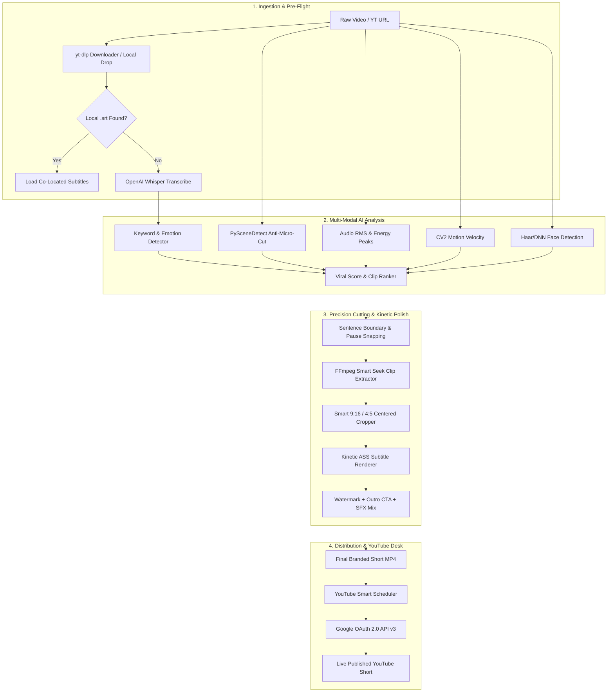
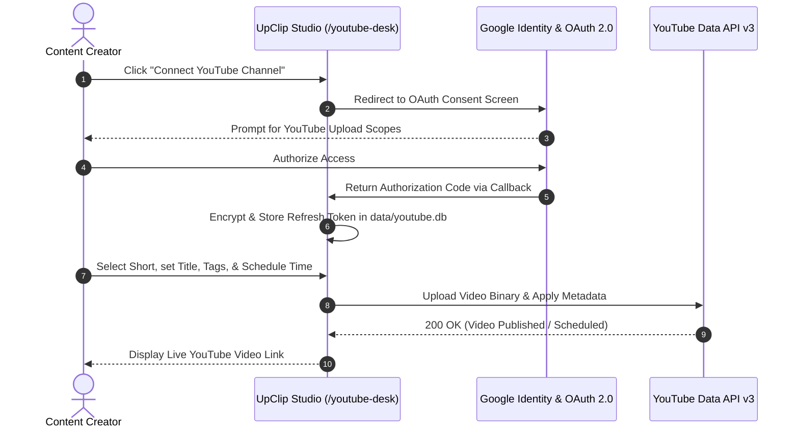

<div align="center">

# ⚡ UpClip Studio

### Next-Gen AI Shorts Studio, Kinetic Caption Engine & YouTube Automation Platform

*Turn long-form videos into viral short-form clips (9:16 / 4:5 / 1:1) automatically.*  
*Powered by OpenAI Whisper, Computer Vision, Multi-Criteria Viral Scoring, Kinetic Animated Subtitles, and 1-Click YouTube Auto-Publishing.*

---

[](https://www.python.org/)
[](https://flask.palletsprojects.com/)
[](https://vitejs.dev/)
[](https://github.com/openai/whisper)
[](https://pytorch.org/)
[](https://opencv.org/)
[](https://ffmpeg.org/)
[](tests/)
[](LICENSE)

</div>

---

## 🌟 Table of Contents
1. [Core Innovations & Viral Capabilities](#-core-innovations--viral-capabilities)
2. [End-to-End Pipeline Architecture](#-end-to-end-pipeline-architecture)
3. [Comprehensive Project Structure](#-comprehensive-project-structure)
4. [Required Extra Files & External Setup Guide](#-required-extra-files--external-setup-guide)
5. [AI Intelligence & Processing Engine Matrix](#-ai-intelligence--processing-engine-matrix)
6. [Creator Caption Presets & Visual Customization](#-creator-caption-presets--visual-customization)
7. [Installation & Quick Start Guide](#-installation--quick-start-guide)
8. [YouTube Automation & Google Cloud Setup](#-youtube-automation--google-cloud-setup)
9. [Automated Verification & Pytest Suite](#-automated-verification--pytest-suite)
10. [License & Acknowledgments](#-license--acknowledgments)

---

## 🚀 Core Innovations & Viral Capabilities

* **⏱️ 60s+ Minimum Floor & Sentence Boundary Snapping**: Eliminates premature, disjointed cuts. Enforces a strict 60s–90s+ duration floor while snapping start/end boundaries to grammatical sentence breaks (`.`, `?`, `!`, `।`) and speech pauses (gap $\ge$ 0.35s). Spoken ideas are never truncated mid-phrase.
* **📐 True Framing & Multi-Aspect Cropping (9:16 / 4:5 / 1:1)**: Dynamic aspect-ratio adaptation avoiding distortion:
  * `9:16` (`1080x1920`): Shorts, TikTok, Instagram Reels.
  * `4:5` (`1080x1350`): Instagram Feed portrait.
  * `1:1` (`1080x1080`): LinkedIn / Twitter square feed.
  * `Original`: Pristine source aspect retention.
* **🔥 Non-Overlapping Kinetic Captions**: Generates short, high-energy 3–4 word bite-sized caption lines with strict sequential timing (Line 1 fades out completely before Line 2 appears). Word-by-word karaoke highlighting synchronized to speech rhythm.
* **✨ Viral Enhancement Suite (`ViralEnhancer`)**:
  * **Brand Watermarks & Logos**: Burn PNG channel logos or text watermarks at custom scale, opacity, and anchor positions.
  * **Interactive Outro CTAs**: Automated creation of Call-To-Action outro cards with animated Subscribe & Bell notifications.
  * **Dynamic Sound Effects (SFX)**: Real-time mixdown of high-impact transitions (`whoosh`, `pop`, `chime`, `click`) synced to visual highlights.
  * **B-Roll Cutaways**: Seamlessly layer cutaway video/image footage with crossfade transitions while retaining continuous speaker audio.
* **🏷️ AI Content-Based Topic Naming**: Natural language keyword extraction replaces generic filenames (`clip_01.mp4`) with descriptive, SEO-optimized topic slugs (e.g. `Election_Commission_Controversy_01.mp4`).
* **📅 YouTube Smart Publishing Advisor & 1-Click Scheduler**: Recommends peak audience evening slots (6:30 PM–9:30 PM), spaces multi-clip uploads by 4–6 hours, caps title lengths for maximum mobile CTR, and executes automated background publishing via Google OAuth 2.0.
* **⚡ Co-Located Subtitle Auto-Detection**: Instant lookup of matching `.srt` files in the `input/` directory, skipping redundant Whisper passes and reducing turn-around time to seconds.

---

## 🔄 End-to-End Pipeline Architecture


```mermaid
flowchart TD
    subgraph INGESTION ["1. Ingestion & Pre-Flight"]
        V[Raw Video / YT URL] --> DL[yt-dlp Downloader / Local Drop]
        DL --> SUB_CHK{Local .srt Found?}
        SUB_CHK -->|Yes| FAST_SUB[Load Co-Located Subtitles]
        SUB_CHK -->|No| WHISPER[OpenAI Whisper Transcribe]
    end

    subgraph ANALYSIS ["2. Multi-Modal AI Analysis"]
        V --> SCENE[PySceneDetect Anti-Micro-Cut]
        V --> AUDIO[Audio RMS & Energy Peaks]
        V --> MOTION[CV2 Motion Velocity]
        V --> FACE[Haar/DNN Face Detection]
        WHISPER --> NLP[Keyword & Emotion Detector]
        SCENE & AUDIO & MOTION & FACE & NLP --> RANKER[Viral Score & Clip Ranker]
    end

    subgraph RENDERING ["3. Precision Cutting & Kinetic Polish"]
        RANKER --> BOUNDS[Sentence Boundary & Pause Snapping]
        BOUNDS --> CUTTER[FFmpeg Smart Seek Clip Extractor]
        CUTTER --> REFRAME[Smart 9:16 / 4:5 Centered Cropper]
        REFRAME --> KINETIC[Kinetic ASS Subtitle Renderer]
        KINETIC --> ENHANCE[Watermark + Outro CTA + SFX Mix]
    end

    subgraph DISTRIBUTION ["4. Distribution & YouTube Desk"]
        ENHANCE --> FINAL[Final Branded Short MP4]
        FINAL --> SCHED[YouTube Smart Scheduler]
        SCHED --> OAUTH[Google OAuth 2.0 API v3]
        OAUTH --> YT[Live Published YouTube Short]
    end
```

---

## 📁 Comprehensive Project Structure

Below is the complete, exhaustive project directory tree. Every internal module, template, stylesheet, client script, and asset is detailed below.

> **Note on `.gitignore` Files:** Folders and files annotated with `# [Ignored]` are excluded from version control for security, storage, or runtime privacy. Their contents, functions, and manual creation rules are detailed in the [Required Extra Files Guide](#-required-extra-files--external-setup-guide).

```text
UpClipStudio/
├── .env.example                     # Environment template for Google OAuth credentials & secrets
├── .env                             # [Ignored / REQUIRED] Live production environment variables
├── .gitignore                       # Git ignore rules for venv, databases, media & builds
├── app.py                           # Application entrypoint & Flask HTTP server factory
├── config.py                        # Central settings: paths, audio, presets, aspect ratios & FFmpeg
├── extensions.py                    # Shared Flask extensions & database instances
├── requirements.txt                 # Pinned Python package dependencies
├── README.md                        # Master project documentation
│
├── 📁 .venv/                        # [Ignored] Python virtual environment (dependencies & interpreter)
│
├── 📁 ai/                           # Multi-Modal AI, Speech, and Computer Vision Modules
│   ├── ai_advisor.py                # Viral score auditing & actionable optimization suggestions
│   ├── animated_caption_renderer.py # Kinetic word-by-word subtitle rendering & ASS generation
│   ├── ass_animation.py             # Advanced ASS subtitle tags, transitions & font animations
│   ├── ass_builder.py               # Dialogue compilation, screen positioning & style formatting
│   ├── audio_energy.py              # RMS volume analysis, reaction bursts & audio peak detector
│   ├── audio_mixer.py               # Background music overlay, ducking & multi-track audio mixer
│   ├── clip_ranker.py               # Multi-criteria scoring, ordinal clip ranking & grade assignment
│   ├── emotion_detector.py          # Sentiment & speech tone analyzer (Excitement, Urgency, etc.)
│   ├── face_detector.py             # OpenCV Haar/DNN face tracking for speaker centering
│   ├── graphics_renderer.py         # Pillow-based progress bars, lower-thirds & badges
│   ├── highlight_engine.py          # Composite highlight candidate generator
│   ├── highlight_ranker.py          # Narrative completeness & hook strength scorer
│   ├── keyword_detector.py          # Real-time keyword spotting in audio transcripts
│   ├── keyword_extractor.py         # Viral keyword extraction & automatic hashtag generator
│   ├── motion_detector.py           # Frame-differencing visual activity & kinetic velocity analyzer
│   ├── scene_detector.py            # PySceneDetect wrapper with anti-micro-cut rules (15s–20s floor)
│   ├── silence_detector.py          # Speech pauses and dead-air detection for pacing optimization
│   ├── smart_reframe.py             # Aspect conversion (16:9 -> 9:16) with face-tracking keyframes
│   ├── subtitle_builder.py          # Standard SRT and VTT subtitle formatting engine
│   ├── subtitle_renderer.py         # FFmpeg burnt-in hardcoded subtitle processor
│   ├── subtitle_styles.py           # Color palettes, typography & bounding box definitions
│   ├── transcript.py                # Full-text transcript manager, word-slicer & filler-word scrubber
│   ├── translation.py               # Multi-language translation engine (20+ supported languages)
│   ├── viral_enhancer.py            # Watermarks, Outro CTA cards, SFX mixdown & B-roll cutaways
│   ├── viral_score.py               # 5-Pillar viral scoring algorithm (Hook, Pacing, Audio, Visual, Time)
│   └── whisper_engine.py            # OpenAI Whisper speech-to-text with model caching & timestamps
│
├── 📁 assets/                       # Reusable Creative Assets & Branding Templates
│   ├── README.md                    # Assets directory format and specifications guide
│   ├── 📁 fonts/                    # [Partially Ignored] Custom TTF/OTF fonts for captions
│   │   └── .gitkeep                 # [Tracked] Preserves empty directory in git
│   ├── 📁 intro/                    # [Ignored] Channel intro branding video bumpers (*.mp4)
│   │   └── .gitkeep                 # [Tracked] Preserves empty directory in git
│   ├── 📁 music/                    # [Ignored] Royalty-free background audio tracks (*.mp3, *.wav)
│   │   └── .gitkeep                 # [Tracked] Preserves empty directory in git
│   ├── 📁 outro/                    # [Ignored] Call-to-action outro cards & subscribe sequences (*.mp4)
│   │   └── .gitkeep                 # [Tracked] Preserves empty directory in git
│   └── 📁 overlays/                 # [Partially Ignored] Transparent channel logos & stickers (*.png)
│       └── .gitkeep                 # [Tracked] Preserves empty directory in git
│
├── 📁 bin/                          # [Ignored / Optional] Local portable FFmpeg binaries
│   ├── ffmpeg.exe                   # Local FFmpeg binary (used if not installed on system PATH)
│   └── ffprobe.exe                  # Local FFprobe binary (used if not installed on system PATH)
│
├── 📁 caption_studio/               # Standalone React + Vite + TypeScript Caption Studio Application
│   ├── package.json                 # Node.js dependencies & build scripts
│   ├── tsconfig.json                # TypeScript compiler configuration
│   ├── vite.config.ts               # Vite bundler build config (outputs to static/caption-studio/)
│   ├── 📁 node_modules/             # [Ignored] Node package dependencies
│   └── 📁 src/                      # Frontend source code
│       ├── App.tsx                  # Main React routing and layout wrapper
│       ├── index.css                # Global Tailwind / custom styling
│       ├── main.tsx                 # DOM entrypoint
│       ├── 📁 pages/                # Workspace views (Editor, ConnectYouTube, UploadQueue, Settings)
│       ├── 📁 store/                # Zustand client state management (editorStore.ts)
│       └── 📁 types/                # TypeScript interface and type definitions
│
├── 📁 core/                         # Core Architecture, State Orchestration & Business Logic
│   ├── ai_copilot.py                # Natural language AI copilot for editing commands
│   ├── audio_manager.py             # Audio stream routing and ducking manager
│   ├── constants.py                 # System-wide operational constants and defaults
│   ├── content_intelligence.py      # Video topic categorization and semantic tagging
│   ├── exceptions.py                # Unified custom exception definitions
│   ├── graphics_manager.py          # Render pipeline overlay and graphic asset compositor
│   ├── logger.py                    # Colored terminal and rotating file logging setup
│   ├── manager.py                   # High-level studio process controller
│   ├── media_manager.py             # Media import registry and file integrity validation
│   ├── preset_manager.py            # User and system caption preset persistence
│   ├── progress.py                  # Thread-safe pipeline progress tracker with ETA calculation
│   ├── project_manager.py           # Multi-project CRUD operations and manifest management
│   ├── project_state.py             # Project timeline state, undo/redo, and revision tracking
│   ├── render_queue.py              # Background clip rendering and multi-threading queue
│   ├── settings_manager.py          # Global and user settings serialization
│   ├── shorts_factory.py            # High-level pipeline factory orchestrating end-to-end runs
│   ├── workspace_manager.py         # Multi-workspace directory isolation
│   └── __init__.py                  # Core package initializer
│
├── 📁 data/                         # [Ignored] Runtime Databases, User Auth & Project State
│   ├── app.db                       # [Generated] SQLite database for projects, brand kit & presets
│   ├── youtube.db                   # [Generated] SQLite database for YouTube OAuth tokens & upload queue
│   ├── users.json                   # [Generated] Local account credentials & password hashes
│   ├── brand_kit.json               # [Generated] User brand kit styles (colors, logos, font picks)
│   ├── custom_caption_presets.json  # [Generated] User-defined custom caption animation presets
│   ├── recent_projects.json         # [Generated] History of recently opened projects
│   ├── 📁 autosave/                 # [Generated] Auto-saved recovery snapshots
│   ├── 📁 projects/                 # [Generated] Saved project workspaces (*.json manifests)
│   ├── 📁 recovery/                 # [Generated] Crash-recovery project backups
│   ├── 📁 reviews/                  # [Generated] Export review ratings and notes
│   └── 📁 versions/                 # [Generated] Project timeline version history
│
├── 📁 input/                        # [Ignored] Ingestion Folder for Source Videos & Subtitles
│   ├── .gitkeep                     # [Tracked] Preserves input directory structure
│   ├── *.mp4                        # [User Media] User-provided source video files to be clipped
│   └── *.srt                        # [User Media] Optional co-located subtitle files (matching video name)
│
├── 📁 logs/                         # [Ignored] Runtime Diagnostic & Error Logs
│   ├── app.log                      # Web application server operational logs
│   ├── ffmpeg.log                   # FFmpeg transcoding stdout and stderr diagnostic logs
│   └── pipeline.log                 # AI pipeline step-by-step debug traces
│
├── 📁 models/                       # Application Data Models
│   ├── project.py                   # Project entity model, clip metadata & timeline schemas
│   └── __init__.py                  # Models package initializer
│
├── 📁 output/                       # [Ignored] Rendered Clips, Subtitles & Final Deliverables
│   ├── 📁 audio/                    # Extracted raw WAV and normalized audio streams
│   ├── 📁 clips/                    # Exported short-form video clips (9:16 / 4:5 / 1:1)
│   ├── 📁 final/                    # Final branded, watermarked & captioned deliverables
│   ├── 📁 frames/                   # Cached video frames for thumbnail generation
│   ├── 📁 subtitles/                # Generated .srt, .vtt, and .ass subtitle files
│   ├── 📁 thumbnails/               # Generated high-CTR vertical video thumbnail images
│   └── 📁 transcript/               # Generated Whisper JSON transcript dictionaries
│
├── 📁 pipeline/                     # Batch Pipeline Runners
│   └── video_pipeline.py            # Sequential pipeline runner integrating all AI stages
│
├── 📁 routes/                       # Flask Blueprints & REST Endpoints
│   ├── __init__.py                  # Routes registration and blueprint discovery
│   ├── caption_studio.py            # Caption Studio API (transcription, preset CRUD, timing sync)
│   ├── download.py                  # Media export, subtitle downloads & batch ZIP archiver
│   ├── editor.py                    # Timeline editor state, split/trim API & interactive playback
│   ├── home.py                      # Dashboard, stats overview & quick-launch navigation
│   ├── media_thumbnail.py           # Real-time thumbnail generator & media frame caching
│   ├── process.py                   # Full AI pipeline job execution, queue tracking & SSE progress
│   ├── projects.py                  # Project management CRUD, rename, duplicate, export & import
│   ├── studio_navigation.py         # Sub-app routing and view switching
│   ├── upload.py                    # Local video upload handling & file integrity validation
│   └── youtube.py                   # Google OAuth 2.0 auth, channel stats, metadata & scheduler
│
├── 📁 static/                       # Static Frontend Assets (Vanilla JS, CSS & Audio)
│   ├── favicon.ico                  # Browser tab icon
│   ├── favicon.svg                  # High-DPI scalable vector icon
│   ├── 📁 audio/                    # Built-in sound effects (SFX) for viral animations
│   │   ├── ambient_music.wav        # Subtle background ambient bed track
│   │   ├── chime.wav                # Milestone or point-scored notification chime
│   │   ├── click.wav                # Crisp button / mechanical tactile click sound
│   │   ├── pop.wav                  # Punchy popping sound for animated word appearances
│   │   ├── upbeat_rhythm.wav        # High-energy modern rhythm track
│   │   ├── voice_sample.wav         # Baseline calibration audio sample
│   │   └── whoosh.wav               # Kinetic zoom/slide transition whoosh
│   ├── 📁 caption-studio/           # Compiled Production Build of React Caption Studio SPA
│   │   ├── index.html               # React app entry point
│   │   └── 📁 assets/               # Bundled JavaScript and CSS assets
│   ├── 📁 css/                      # Custom Glassmorphic Stylesheets
│   │   ├── creator_desk.css         # YouTube Creator Desk layout & scheduler styling
│   │   ├── style.css                # Master UpClip Studio glassmorphism UI theme
│   │   └── 📁 caption_studio/       # Embedded styling for caption studio views
│   │       └── caption_studio.css   # Caption timeline, word chips & style editor CSS
│   ├── 📁 img/                      # UI Graphics & Fallback Media
│   │   ├── default_thumb.png        # Fallback video thumbnail placeholder
│   │   └── favicon.png              # Raster PNG favicon
│   ├── 📁 js/                       # Modular Client Scripts
│   │   ├── app_framework.js         # Core UI notifications, modals & WebSocket/SSE listeners
│   │   ├── caption_studio.js        # Timeline scrubber, subtitle editing & preset applier
│   │   ├── editor.js                # In-browser trim, crop & clip preview player
│   │   ├── main.js                  # AI Clipper workflow, video selection & progress bar
│   │   ├── youtube-desk.js          # Google OAuth, channel management & release scheduler
│   │   ├── yt-downloader.js         # YouTube ingestion UI, stream picker & subtitle extractor
│   │   └── 📁 caption_studio/       # Caption Studio client sub-modules
│   │       └── caption_studio.js    # Kinetic preview canvas & word-sync logic
│   └── 📁 uploads/                  # [Ignored / Semi-tracked] Temporary User Assets
│       ├── .gitkeep                 # [Tracked] Preserves uploads directory structure
│       ├── 📁 brolls/               # [Ignored] Temporary user-uploaded B-roll video cutaways
│       ├── 📁 logos/                # [Ignored] Temporary user-uploaded watermark logos
│       └── 📁 previews/             # [Ignored] Generated temporary outro card preview frames
│
├── 📁 templates/                    # Jinja2 HTML5 Responsive Web Templates
│   ├── caption_studio.html          # Embedded Caption Studio workspace view
│   ├── editor.html                  # Advanced video editor & fine-trim timeline interface
│   ├── guide.html                   # Interactive user manual & viral creation playbook
│   ├── home.html                    # Main dashboard, recent projects & system telemetry
│   ├── index.html                   # AI Clipper Studio (Video ingestion, pipeline config & preview)
│   ├── studio_hub.html              # Central navigation hub for all studio tools
│   ├── youtube_desk.html            # YouTube Creator Desk (OAuth, metadata editor & scheduler)
│   └── yt_downloader.html           # YouTube Video, Audio & Fast Subtitle Downloader view
│
├── 📁 tests/                        # Comprehensive Pytest Automated Test Suite
│   ├── test_ai_suite.py             # Unit tests for all 15+ AI computer vision & audio modules
│   ├── test_caption_studio.py       # API & rendering tests for Caption Studio endpoints
│   ├── test_clips.py                # Tests for FFmpeg fast-seek clip cutter & frame accurate bounds
│   ├── test_custom_settings_and_upload.py # Upload validator & aspect-ratio settings tests
│   ├── test_home.py                 # Route tests for home dashboard and telemetry endpoints
│   ├── test_projects.py             # Project state serialization, CRUD & manifest tests
│   ├── test_thumbnails.py           # Automated vertical thumbnail generation tests
│   ├── test_viral_features.py       # Tests for watermarks, outro cards, SFX mixdown & B-roll
│   ├── test_youtube.py              # YouTube OAuth flow, token encryption & scheduler tests
│   └── test_youtube_download.py     # yt-dlp downloader & fast subtitle extraction tests
│
└── 📁 weights/                      # [Ignored / Optional] Local Offline Whisper & Model Weights
    ├── base.pt                      # [Optional] Whisper Base model weights (auto-cached if omitted)
    └── small.pt                     # [Optional] Whisper Small model weights
```

---

## 🛠️ Required Extra Files & External Setup Guide

Because UpClip Studio processes high-definition video, connects securely to Google APIs, and saves local project states, several files and directories are **deliberately excluded from GitHub via `.gitignore`**.

Review this breakdown of the extra files required, why they are needed, and how to configure them:

### 1. `.env` — Environment Credentials File *(Mandatory for YouTube Publishing)*
* **Location**: `.env` (Project Root)
* **Status**: Gitignored (contains private API secrets).
* **How to Create**:
  ```bash
  # Copy the provided template:
  cp .env.example .env        # macOS/Linux
  copy .env.example .env      # Windows PowerShell/CMD
  ```
* **What to Put Inside**:
  ```env
  # Google OAuth 2.0 Credentials (From Google Cloud Console)
  GOOGLE_CLIENT_ID=your_client_id_here.apps.googleusercontent.com
  GOOGLE_CLIENT_SECRET=your_client_secret_here
  GOOGLE_REDIRECT_URI=http://127.0.0.1:5000/youtube/callback

  # Flask Secret Key (Used for session cookie signing)
  SECRET_KEY=your_secure_random_hex_string_here

  # (Optional) Custom FFmpeg binary paths if not on system PATH:
  # FFMPEG_PATH=C:/ffmpeg/bin/ffmpeg.exe
  # FFPROBE_PATH=C:/ffmpeg/bin/ffprobe.exe
  ```

---

### 2. `FFmpeg` & `FFprobe` Binaries *(Mandatory for Video Processing)*
* **Location**: Accessible in system `PATH` **OR** placed locally in `bin/` (`bin/ffmpeg.exe`, `bin/ffprobe.exe`).
* **Why it's Needed**: Powers video decoding, scene cutting, aspect cropping, ASS subtitle burning, and SFX audio mixing.
* **Setup Instructions**:
  * **Windows (Chocolatey / Scoop)**:
    ```powershell
    choco install ffmpeg-full
    # OR scoop install ffmpeg
    ```
  * **macOS (Homebrew)**:
    ```bash
    brew install ffmpeg --with-libass
    ```
  * **Ubuntu / Debian**:
    ```bash
    sudo apt update && sudo apt install ffmpeg libass-dev
    ```
  * *Verification*: Run `ffmpeg -version` in your terminal to confirm availability.

---

### 3. `input/` — Source Media Ingestion Directory *(Auto-Created / User Media)*
* **Location**: `input/`
* **Status**: Gitignored (keeps repository lightweight).
* **What to Put Inside**:
  * Any `.mp4`, `.mov`, or `.mkv` source videos you want UpClip Studio to analyze and turn into shorts.
  * *(Optional)* **Co-located Subtitle Files**: If you place `my_video.srt` in `input/` alongside `my_video.mp4`, UpClip Studio automatically detects and uses it, skipping Whisper transcription and cutting processing time to seconds!

---

### 4. `data/` — Local SQLite Databases & Workspace Store *(Auto-Generated)*
* **Location**: `data/`
* **Status**: Gitignored (protects private tokens and user projects).
* **What it Contains**:
  * `app.db`: SQLite database storing project metadata, brand kit definitions, and custom caption presets.
  * `youtube.db`: SQLite database storing encrypted OAuth access/refresh tokens and the background upload queue.
  * `projects/`: Subdirectory holding individual project JSON manifests.
* *Note*: UpClip Studio automatically initializes `data/` and all database schemas on first boot. No manual database setup is required.

---

### 5. `output/` — Rendered Deliverables Directory *(Auto-Generated)*
* **Location**: `output/`
* **Status**: Gitignored (prevents multi-gigabyte media builds from polluting git history).
* **Subdirectory Breakdown**:
  * `output/clips/`: Initial rendered 9:16 or 4:5 video clips extracted from scenes.
  * `output/final/`: Final deliverables with burnt-in animated subtitles, watermarks, and outro CTA cards.
  * `output/subtitles/`: Generated `.srt`, `.vtt`, and `.ass` subtitle files.
  * `output/thumbnails/`: High-resolution vertical thumbnail snapshots.
  * `output/transcript/`: Full Whisper JSON transcripts with word-level timestamps.

---

### 6. `assets/` — Custom Typography & Brand Elements *(Optional Customization)*
* **Location**: `assets/`
* **What to Put Inside**:
  * `assets/fonts/`: Place custom `.ttf` or `.otf` font files here (e.g. `Montserrat-ExtraBold.ttf`, `TheBoldFont.ttf`). The caption renderer automatically registers fonts found in this folder.
  * `assets/overlays/`: High-resolution transparent `.png` logos or watermarks.
  * `assets/intro/`: 1080x1920 or 1920x1080 channel intro bumpers.
  * `assets/outro/`: 5–10 second Subscribe / Follow outro CTA video clips.
  * `assets/music/`: Royalty-free `.mp3` or `.wav` background tracks for automatic ducked audio mixdown.

---

### 7. `weights/` — Offline Whisper Model Weights *(Optional)*
* **Location**: `weights/`
* **Status**: Gitignored (model files are 150MB–3GB).
* **Usage**: By default, UpClip Studio automatically downloads the specified Whisper model (e.g. `base`, `small`, or `medium`) into the standard HuggingFace/PyTorch cache on first run. If running in an air-gapped or offline environment, you can place model files (`base.pt`, etc.) directly into `weights/`.

---

## 🧠 AI Intelligence & Processing Engine Matrix

UpClip Studio uses a modular, multi-modal intelligence layer located in [`ai/`](ai/):

| Module | Primary Class | Algorithm & Technical Details |
| :--- | :--- | :--- |
| [`whisper_engine.py`](ai/whisper_engine.py) | `WhisperEngine` | Multi-lingual speech-to-text with GPU acceleration, word-level timestamps, and VAD pause alignment. |
| [`scene_detector.py`](ai/scene_detector.py) | `SceneDetector` | Detects visual camera cuts & pacing boundaries while enforcing a strict 15s–20s minimum duration floor. |
| [`audio_energy.py`](ai/audio_energy.py) | `AudioEnergyDetector` | Computes RMS audio energy across sliding time windows to detect laughter, applause, gasps, and punchlines. |
| [`motion_detector.py`](ai/motion_detector.py) | `MotionDetector` | Frame-differencing computer vision engine measuring pixel velocity and visual motion dynamics. |
| [`face_detector.py`](ai/face_detector.py) | `FaceDetector` | OpenCV Haar & DNN face detection measuring speaker prominence, bounding boxes, and center of mass. |
| [`emotion_detector.py`](ai/emotion_detector.py) | `EmotionDetector` | Classifies sentiment tones (Excitement, Surprise, Curiosity, Urgency) from linguistics and audio pitch. |
| [`keyword_extractor.py`](ai/keyword_extractor.py) | `KeywordExtractor` | Extracts viral keywords, high-converting n-gram phrases, and automatically generates hashtags (`#Shorts`, `#Viral`). |
| [`viral_score.py`](ai/viral_score.py) | `ViralScoreCalculator` | 5-pillar viral predictor (Hook, Pacing, Audio, Visual, Duration) returning 0–100 scores and actionable tips. |
| [`clip_ranker.py`](ai/clip_ranker.py) | `ClipRanker` | Multi-criteria clip sorter assigning ordinal ranks (`Rank 1`, `Top Pick`), letter grades (`A+`, `A`), and viral badges. |
| [`highlight_ranker.py`](ai/highlight_ranker.py) | `HighlightRanker` | Ranks raw candidate highlights prioritizing narrative completion and audience hook strength. |
| [`transcript.py`](ai/transcript.py) | `TranscriptManager` | Full-text keyword search with timestamps, clip-accurate word slicing `slice(start, end)`, and filler-word cleaning. |
| [`smart_reframe.py`](ai/smart_reframe.py) | `SmartReframer` | Intelligent 16:9 to 9:16 vertical reframer keeping subjects dynamically centered using face tracking keyframes. |
| [`silence_detector.py`](ai/silence_detector.py) | `SilenceDetector` | Identifies pauses, hesitation, and dead air to tighten clip pacing for maximum viewer retention. |
| [`viral_enhancer.py`](ai/viral_enhancer.py) | `ViralEnhancer` | Burn watermarks, generate outro CTA cards, mixdown dynamic sound effects, and overlay B-roll video cutaways. |
| [`animated_caption_renderer.py`](ai/animated_caption_renderer.py) | `AnimatedCaptionRenderer` | Renders kinetic word-by-word highlighted captions using custom styling and precise time-synced ASS scripts. |

---

## 🎨 Creator Caption Presets & Visual Customization

UpClip Studio includes 6 battle-tested creator presets ready to use out-of-the-box:

| Preset Name | Visual Style | Typography | Highlight Color | Animation Style |
| :--- | :--- | :--- | :--- | :--- |
| **Hormozi Pop** | High-contrast bold yellow font with heavy black outline | Arial Black / Montserrat Bold | `#FFE600` (Electric Yellow) | Zoom-in scale burst on active spoken word |
| **MrBeast Glow** | Punchy white-to-green gradient with vibrant neon drop shadow | Impact / TheBoldFont | `#22C55E` (Emerald Green) | Glow pulse with letter-spacing bounce |
| **Red Punch** | Intense red highlight with white secondary text | Arial Black | `#EF4444` (Vibrant Crimson) | Snap emphasis on keyword transitions |
| **Clean Gold** | Elegant golden luxury styling with subtle drop shadow | Montserrat ExtraBold | `#F59E0B` (Warm Gold) | Smooth fade & gentle vertical elevation |
| **Neon Cyber** | Electric cyan on dark background with cyber glow | Trebuchet MS / Outfit | `#06B6D4` (Electric Cyan) | Glitch flash on sentence kickoffs |
| **Karaoke Pill** | Pill-shaped background container behind active words | Helvetica Bold | `#A855F7` (Deep Purple) | Continuous horizontal pill highlight slider |

---

## ⚡ Installation & Quick Start Guide

### Step 1: Clone the Repository
```bash
git clone https://github.com/iamadarss/cipping.git
cd cipping
```

### Step 2: Set Up Python Virtual Environment
* **On Windows**:
  ```powershell
  python -m venv .venv
  .venv\Scripts\activate
  ```
* **On macOS / Linux**:
  ```bash
  python3 -m venv .venv
  source .venv/bin/activate
  ```

### Step 3: Install Dependencies
```bash
pip install --upgrade pip
pip install -r requirements.txt
```

### Step 4: Configure Environment Variables
```bash
# Copy the example environment file:
cp .env.example .env        # macOS/Linux
copy .env.example .env      # Windows PowerShell

# Open .env in your editor and add your Google OAuth client ID/secret
```

### Step 5: (Optional) Build Caption Studio SPA
If you intend to modify the React + Vite Caption Studio:
```bash
cd caption_studio
npm install
npm run build
cd ..
```
*(The compiled production assets are already pre-bundled in `static/caption-studio/`)*

### Step 6: Launch UpClip Studio
```bash
python app.py
```
Open your browser and navigate to:  
👉 **`http://127.0.0.1:5000`**

---

## 📺 YouTube Automation & Google Cloud Setup

UpClip Studio's **YouTube Desk** allows creators to schedule, publish, and track Shorts directly from the dashboard:


```mermaid
sequenceDiagram
    autonumber
    actor Creator as Content Creator
    participant Desk as UpClip Studio (/youtube-desk)
    participant Google as Google Identity & OAuth 2.0
    participant YouTube as YouTube Data API v3

    Creator->>Desk: Click "Connect YouTube Channel"
    Desk->>Google: Redirect to OAuth Consent Screen
    Google-->>Creator: Prompt for YouTube Upload Scopes
    Creator->>Google: Authorize Access
    Google->>Desk: Return Authorization Code via Callback
    Desk->>Desk: Encrypt & Store Refresh Token in data/youtube.db
    Creator->>Desk: Select Short, set Title, Tags, & Schedule Time
    Desk->>YouTube: Upload Video Binary & Apply Metadata
    YouTube-->>Desk: 200 OK (Video Published / Scheduled)
    Desk-->>Creator: Display Live YouTube Video Link
```

### Quick 5-Step Google Cloud Configuration:
1. Navigate to the [Google Cloud Console](https://console.cloud.google.com/).
2. Create a new project (e.g. `UpClip Studio Automation`).
3. Under **APIs & Services**, enable the **YouTube Data API v3**.
4. Go to **Credentials** → **Create Credentials** → **OAuth client ID**:
   * Application type: **Web application**.
   * Authorized redirect URIs: `http://127.0.0.1:5000/youtube/callback`
5. Copy the generated **Client ID** and **Client Secret** into your `.env` file:
   ```env
   GOOGLE_CLIENT_ID=your_id.apps.googleusercontent.com
   GOOGLE_CLIENT_SECRET=your_secret
   GOOGLE_REDIRECT_URI=http://127.0.0.1:5000/youtube/callback
   ```

---

## 🧪 Automated Verification & Pytest Suite

UpClip Studio maintains a comprehensive test suite covering the entire pipeline:

```bash
# Run the full automated test suite (Capturing output disabled for Python 3.14 stability):
pytest -s tests/

# Target individual module tests:
pytest -s tests/test_ai_suite.py           # Multi-modal AI and computer vision
pytest -s tests/test_viral_features.py     # Watermarks, outro CTAs, SFX and B-roll
pytest -s tests/test_caption_studio.py     # Subtitle sync, ASS scripts and presets
pytest -s tests/test_youtube.py            # OAuth token management and scheduler
pytest -s tests/test_clips.py              # FFmpeg clip cutting and frame boundaries
```

All 64 test cases execute synchronously and validate:
* Scene cut thresholding and 15s–20s anti-micro-cut preservation.
* Audio peak extraction and reaction tone classification.
* Word boundary timestamp alignment and ASS dialogue formatting.
* YouTube OAuth token refresh logic and background queue persistence.

---

## 📄 License & Acknowledgments

This project is licensed under the **MIT License** — see the [LICENSE](LICENSE) file for complete details.

* **OpenAI Whisper** for state-of-the-art automatic speech recognition.
* **PySceneDetect** for intelligent, content-aware video cut identification.
* **FFmpeg** for high-performance audio/video manipulation and encoding.
* **OpenCV** for real-time computer vision and facial detection.

<div align="center">
  <sub>Built with ❤️ for creators, video editors, and AI developers.</sub>
</div>